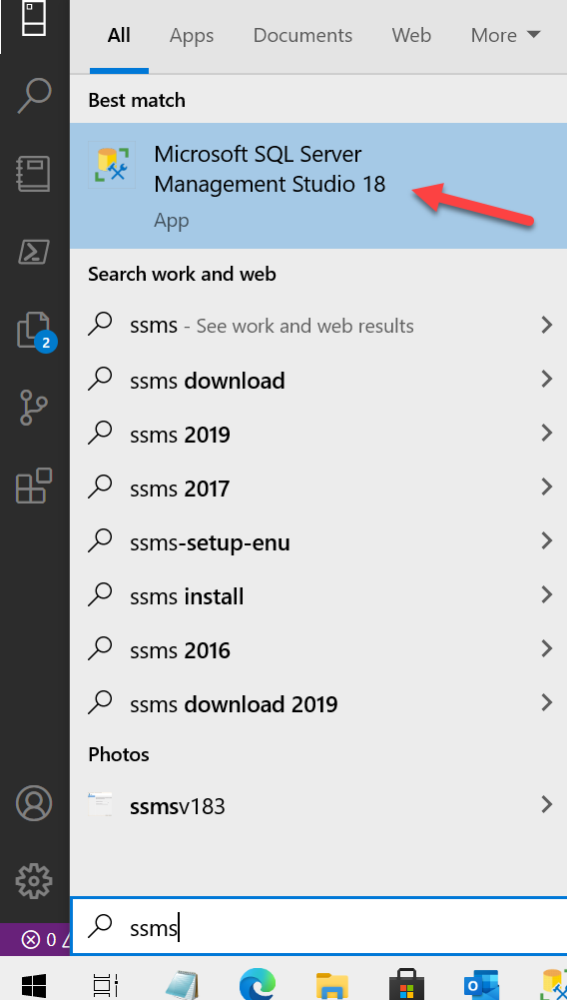
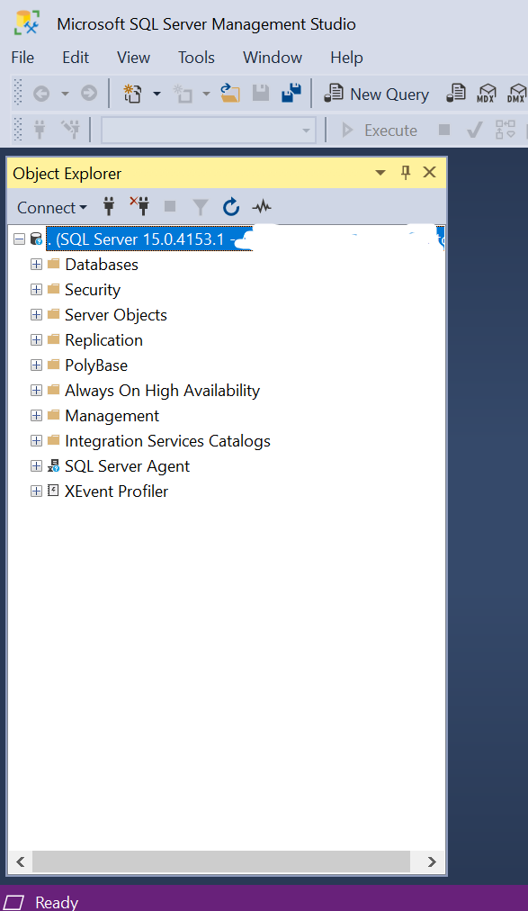

# **Requisitos curso T-SQL 0 a 100**

En este documento se definen los requerimientos que usaremos en el curso gratuito de T-SQL de 0 a 100

**SQL Server 2019 Developer edition**

Usaremos SQL Server 2019 Developer edition pero también se puede usar Enterprise o Standard si ya se tiene uno instalado. La edición developer es 100% gratuita y se la puede descargar desde Microsoft. En el siguiente link encontraran un tutorial paso a paso de como instalar SQL Server 2019

[Instalar y configurar SQL 2019 Developer paso a paso - Blog SQL Server, Power BI y BI (triggerdb.com)](https://blogs.triggerdb.com/2021/06/02/instalar-y-configurar-sql-2019-developer-paso-a-paso/)

**SQL Server Management Studio (SSMS)**

Es la herramienta cliente para poder programar y administrar SQL Server. Usaremos esta herramienta para poder ejecutar nuestro código de TSQL. La misma es gratuita y se debe descargar del siguiente link para luego instalarla en nuestra computadora que usaremos en el curso

[Download SQL Server Management Studio (SSMS) - SQL Server Management Studio (SSMS) | Microsoft Docs](https://docs.microsoft.com/en-us/sql/ssms/download-sql-server-management-studio-ssms?view=sql-server-ver15)

**Prueba de conexón**

Luego de instalar el SQL Server 2019 y SSMS haremos una prueba de conexión. Para eso haremos los siguientes pasos

1. Abrir el SSMS&nbsp; 

2. Poner los datos de acceso al SQL Server 2019 y sus credenciales, si es local en nombre de la instancia se puede escribir (.) punto o localhost

**Base de datos de ejemplo:**

Usaremos la base de datos Adventureworks2019 de Microsoft la cual se puede descargar del siguiente link y se debe restaurar en nuestro SQL Server 2019. En el enlace se encuentra el tutorial paso a paso de cómo hacer esta operación

  

[AdventureWorks sample databases - SQL Server | Microsoft Docs](https://docs.microsoft.com/en-us/sql/samples/adventureworks-install-configure?view=sql-server-ver15&tabs=ssms)

# **Videos de las clases**

**Clase 01**

